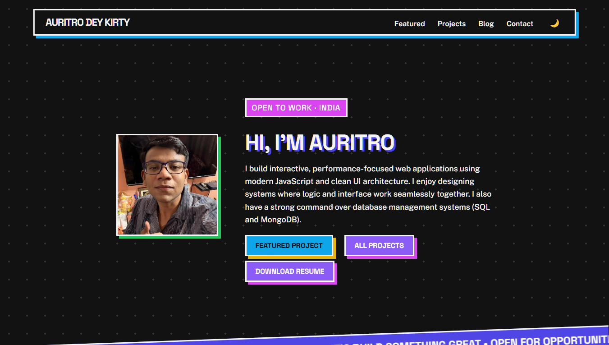
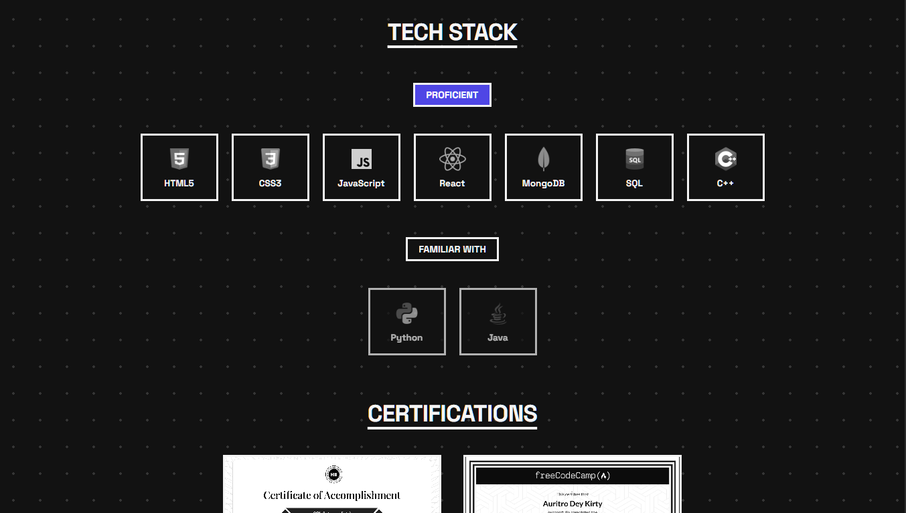

# Auritro Dey Kirty | Portfolio

A multi-page personal portfolio site built entirely from scratch with HTML, CSS, and JavaScript. No frameworks, no templates, no shortcuts were used.

> **Live Site → [auritrodeykirty07.github.io/Portfolio](https://auritrodeykirty07.github.io/Portfolio/)**

---

## What's inside

This isn't a single `index.html` dump. It's a proper multi-page site:

| Page | What it does |
|---|---|
| `index.html` | Landing — hero, about, skills, contact |
| `projects.html` | Project showcase with filtering |
| `blog.html` | Blog/writing section |

The CSS alone spans three files (`styles.css`, `upgrades.css`, `project-styles.css`), because I wanted to capture my progress throughout my frontend journey.

---

## What makes it interesting technically

- **Zero frameworks** — every animation, layout, and interaction is hand-written CSS and vanilla JS
- **Multi-page architecture** — separate pages with shared design language, not a single-page scroll dump
- **Custom animations** — scroll effects, transitions, and UI interactions written from scratch
- **Responsive across all breakpoints** — built with real mobile behaviour, not just a media query slapped at the end
- **Resume embedded** — PDF linked directly, accessible in one click
- **101 commits** — not a one-night project, actively developed and refined

---

## Tech


**No build tools. No dependencies. Just the platform.**

---

## Screenshots






---

## Run locally

No build step. Just clone and open.

```bash
git clone https://github.com/AuritroDeyKirty07/Portfolio
cd Portfolio
# open index.html in your browser
```

---

## Project structure

```
Portfolio/
├── index.html          # Main landing page
├── projects.html       # Projects showcase
├── blog.html           # Blog section
├── styles.css          # Core styles
├── upgrades.css        # Design iterations & enhancements
├── project-styles.css  # Projects page styles
├── script.js           # Main JS
├── upgrades.js         # Enhanced interactions
├── project-script.js   # Projects page logic
├── images/             # Assets
└── AURITRO DEY KIRTY_RESUME.pdf
```

---

## Connect

[](https://auritrodeykirty07.github.io/Portfolio/)
[](https://www.linkedin.com/in/auritro-dey-kirty)
[](https://github.com/AuritroDeyKirty07)
